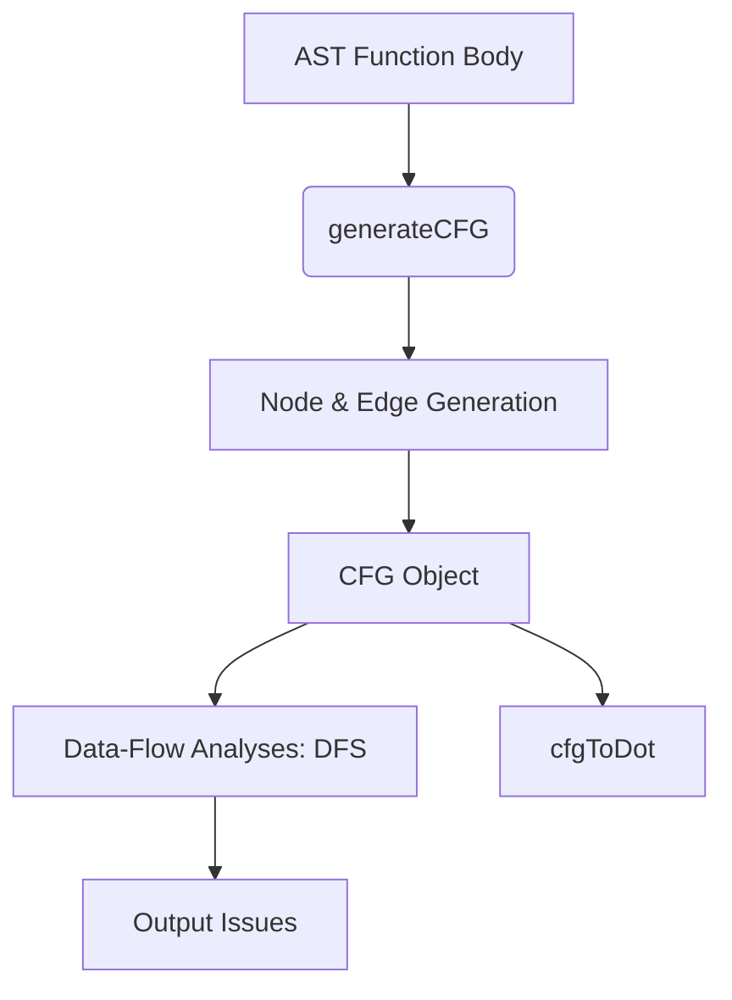

# Compiler Design Analysis: `CfgGenerator.js`

## 1. 📌 File Overview
- **File Name:** `analyzer/CfgGenerator.js`
- **Purpose:** Converts the AST into a Control Flow Graph (CFG) and performs advanced graph-based data-flow analyses (unreachable code, infinite loops, unused variables).
- **Role in Pipeline:** This serves as the **Intermediate Representation (IR) generation and Optimization/Analysis phase** of the compiler.

## 2. 🧠 High-Level Logic
**Overall Action:** It performs multiple AST and graph traversals. It creates graph nodes representing code blocks and edges representing execution flow. Then it traverses this graph to detect coding anomalies.
**Input → Processing → Output**
- **Input:** Abstract Syntax Tree (AST) of a function.
- **Processing:** AST to CFG translation, followed by Depth-First Search (DFS) on the CFG.
- **Output:** A CFG object (`{ nodes, edges }`) and lists of detected issues (unreachable nodes, unused vars).

## 3. 🔄 Execution Flow
1. **CFG Construction (`generateCFG`)**: Starts at `Start` node. Recursively walks AST statements. Creates branches for `if`/`while`, maintaining lists of "current ending edges" to attach next statements to.
2. **Analysis (`findUnusedVariablesCFG`, `findUnreachableNodes`)**: Uses the generated CFG edges to perform DFS.
3. **Graphviz DOT (`cfgToDot`)**: Formats graph into DOT string language.

### Flowchart

## 4. 🏗️ Compiler Design Concepts Mapping

### 🔹 CFG (Control Flow Graph)
- **Concept:** A directed graph where nodes represent basic blocks of instructions and edges represent jumps in control flow.
- **In Code:** `generateCFG(functionNode)` builds this exactly. It implements **Environment Passing**. When processing an `IfStatement`, it splits incoming edges into two (True/False branches), processes the nested AST nodes, and merges the resulting edges back together to continue the flow.

### 🔹 Optimization / Flow Analysis
- **Concept:** Using the IR to perform liveness analysis and dead code elimination.
- **In Code:**
  - **Dead Code (Unreachable Nodes):** `findUnreachableNodes` runs DFS from the Entry node. Any node not marked as "visited" is mathematically dead code.
  - **Liveness (Unused Variables):** `findUnusedVariablesCFG` creates a Set of all declared variables (from AST) and subtracts a Set of all used identifiers (from the *reachable* CFG nodes).

## 5. 🔌 Code-Level Explanation
- **`traverse(statements, incomingEnds)`**: The heart of CFG generation. `incomingEnds` holds the edges from previous statements. For an `IfStatement`, it creates a conditional node, passes `[condId]` as the incoming end to the consequent body, and then merges the ends of the consequent and alternate blocks into `currentEnds`.
- **`findUnusedVariablesCFG(functionNode, cfg)`**:
  - Step 1: Collect declarations via AST traversal.
  - Step 2: Traverse CFG edges using a Stack (DFS) to find reachable nodes.
  - Step 3: For reachable nodes, collect Identifier usages.

## 6. 📊 Data Structures Used
- **Directed Graph:** Represented by `{ nodes: [], edges: [] }`. 
- **Adjacency List:** Used in analysis (`const edgesFrom = {}`) to quickly find neighboring nodes.
- **Stack & Set:** Used for non-recursive DFS (`const stack = []; const visited = new Set();`) to prevent stack overflow on deep graphs.

## 7. 🔗 Integration with Project
- **Position in Pipeline:** `AST -> [CfgGenerator.js] -> CFG IR -> Metadata Object`
- Fed by `functionExtractor` after AST generation. Its output (the CFG and warnings) is injected into the JSDoc generator.

## 8. 🧪 Example Walkthrough
**Snippet:** `if (x) { return 1; } y = 2;`
1. `generateCFG` creates `if(x)` diamond node.
2. Branches to True. Creates `return 1` node. It connects to `EndNode`. It returns `[]` (no outgoing edges).
3. Branches to False. `currentEnds` holds the False edge.
4. Reads `y = 2`. Connects False edge to `y = 2`.
5. DFS analysis later sees `return 1` goes straight to End, so `y = 2` is only reachable via False branch. If there was code *after* `return 1` on the True branch, DFS wouldn't reach it, flagging it as unreachable.

## 9. ⚠️ Edge Cases & Limitations
- **Basic Blocks:** It maps one AST statement per CFG node, rather than grouping sequential statements into true "Basic Blocks", which makes the graph larger than necessary.

## 10. 📈 Improvements
- Implement standard Basic Block grouping (combining sequential non-branching statements into a single node) to optimize graph size.
