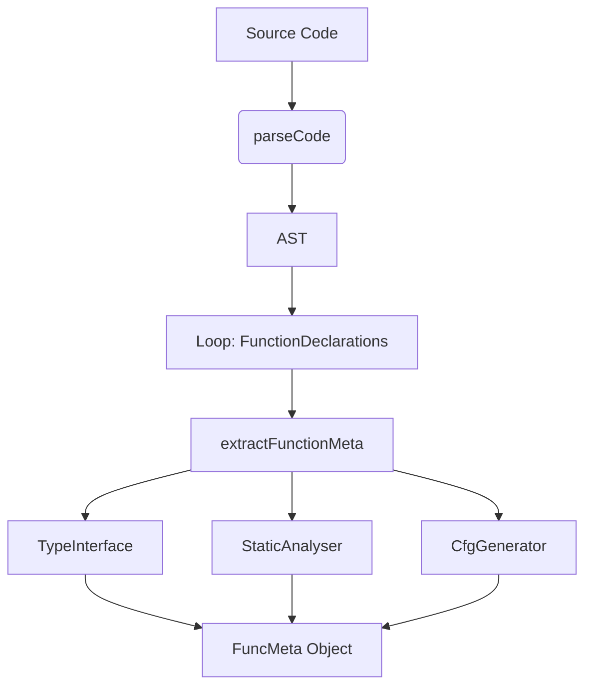

# Compiler Design Analysis: `functionExtractor.js`

## 1. 📌 File Overview
- **File Name:** `extractors/functionExtractor.js`
- **Purpose:** Parses the code and orchestrates all analysis modules (type, static, CFG) to produce a unified metadata object for each function.
- **Role in Pipeline:** Acts as the **Compiler Driver / Coordinator pass**.

## 2. 🧠 High-Level Logic
**Overall Action:** Takes raw code, calls the parser to get an AST, iterates through all top-level functions, and invokes every analysis tool on them.
**Input → Processing → Output**
- **Input:** Raw source code string.
- **Processing:** Invokes Parser -> Iterates over Function nodes -> Invokes Analyzers.
- **Output:** Array of `funcMeta` objects containing everything known about the functions.

## 3. 🔄 Execution Flow
1. Calls `parseCode(fileContent)` to generate the initial AST.
2. Iterates over `ast.body`.
3. For each `FunctionDeclaration`, calls `extractFunctionMeta(node)`.
4. `extractFunctionMeta` runs: `inferParamType`, `inferReturnType`, `analyzeFunctionBody`, `generateCFG`, `findUnreachableNodes`, `detectInfiniteLoops`, `findUnusedVariablesCFG`.
5. Bundles results into an object.

### Flowchart

## 4. 🏗️ Compiler Design Concepts Mapping

### 🔹 Compiler Driver / Pass Orchestration
- **Concept:** The main program that controls the execution of compiler passes (Front-end, Middle-end, Back-end).
- **In Code:** `functionExtractor.js` acts exactly like a traditional compiler driver (like `gcc` or `clang` command line executables). It manages the hand-off of the AST between the isolated analysis phases.

## 5. 🔌 Code-Level Explanation
- **`extractFunctions(fileContent)`**: The entry point. Extracts `node.range` and `node.loc` from the AST to remember where the function lives in the source code (crucial for injecting comments later).
- **`extractFunctionMeta(node)`**: A pure orchestration function. It maps the AST parameters array to the Type Inferencer, and bundles the resulting `patterns`, `cfg`, and `unreachableNodes` into a single record.

## 6. 📊 Data Structures Used
- **Array of Objects:** Returns a linear collection of detailed records.
- **AST Node Retention:** Stores the raw `node.body` in the metadata, retaining the AST for downstream components if needed.

## 7. 🔗 Integration with Project
- **Position in Pipeline:** `Source Code -> [functionExtractor.js] -> Full Metadata Array`
- Called directly by `extension.js`. It bridges the raw source code and the detailed analysis phases.

## 8. 🧪 Example Walkthrough
**Snippet:** `function A() {} function B() {}`
1. Parses code, AST has two function nodes.
2. Passes Node A to analyzers -> returns Meta A.
3. Passes Node B to analyzers -> returns Meta B.
4. Returns `[Meta A, Meta B]`.

## 9. ⚠️ Edge Cases & Limitations
- **Arrow Functions:** It specifically loops looking for `node.type === 'FunctionDeclaration'`. It ignores `VariableDeclaration` nodes holding Arrow Functions (`const a = () => {}`) or Class Methods.

## 10. 📈 Improvements
- Implement an AST walker (like `estraverse`) in `extractFunctions` to find *all* function types (Arrow, Class Method, Expression) deeply nested in the file, not just top-level declarations.
