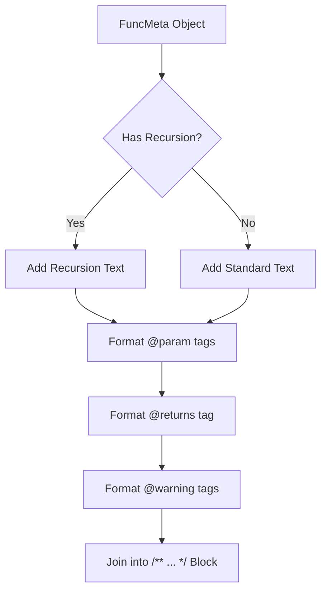

# Compiler Design Analysis: `JsDocGenerator.js`

## 1. 📌 File Overview
- **File Name:** `generators/JsDocGenerator.js`
- **Purpose:** Converts the analyzed metadata into a formatted JSDoc comment block.
- **Role in Pipeline:** Represents the **Code Generation** and **Syntax-Directed Translation (SDT)** output phase.

## 2. 🧠 High-Level Logic
**Overall Action:** Takes the structured data (types, recursion semantics, warnings) and translates it into a target output syntax (JSDoc markup).
**Input → Processing → Output**
- **Input:** A `funcMeta` object containing types, patterns, CFG warnings.
- **Processing:** String template manipulation based on logic flags.
- **Output:** A multi-line string starting with `/**` and ending with `*/`.

## 3. 🔄 Execution Flow
1. Reads recursion flags. Generates description lines.
2. Maps `params` array to `@param {type} name - desc` tags.
3. Checks `returns` object to generate `@returns {type}` tag.
4. Appends `@warning` tags if CFG detected unreachable code, infinite loops, or unused variables.
5. Joins all lines with `\n * `.

### Flowchart


## 4. 🏗️ Compiler Design Concepts Mapping

### 🔹 Code Generation / SDT (Syntax-Directed Translation)
- **Concept:** Producing the final target language output based on the Semantic Model or IR.
- **In Code:** Just as a compiler back-end translates IR into Assembly, `generateJSDoc` translates the Semantic Model (`funcMeta`) into the target language: JSDoc markdown. It applies translation rules (e.g., if semantic tag "HTTP requests" is present, emit text "It utilizes HTTP requests").

## 5. 🔌 Code-Level Explanation
- **Description Mapping:**
  ```javascript
  if (patterns.recursion.isRecursive) { descriptionLines.push(...) }
  ```
  Uses the semantic attributes extracted during the AST traversal to dictate the code generation.
- **Warning Generation:**
  ```javascript
  const unreachableTag = unreachableNodes.length ? [' * @warning Unreachable code...', ...] : [];
  ```
  Translates the CFG data-flow analysis results directly into developer-facing compiler warnings.

## 6. 📊 Data Structures Used
- **Arrays of Strings:** Uses intermediate arrays (`descriptionLines`, `paramTags`) to collect generated code lines, which are finally `.join('\n')`ed. This is a common, highly efficient pattern for string-building code generators to avoid repeated string concatenation overhead.

## 7. 🔗 Integration with Project
- **Position in Pipeline:** `Metadata Object -> [JsDocGenerator.js] -> Final String`
- Called by `extension.js`. The output string is what actually gets written into the user's text editor.

## 8. 🧪 Example Walkthrough
**Snippet Data:** `{ name: 'calc', params: [{name: 'x', type: 'number'}], returns: {type: 'number'} }`
1. Creates description: "Calculates the calc function."
2. Formats Param: `* @param {number} x - The value of x.`
3. Formats Return: `* @returns {number} The result...`
4. Joins arrays into `/**\n * Calculates...\n * @param...\n */`.

## 9. ⚠️ Edge Cases & Limitations
- **Hardcoded Strings:** The description generation relies heavily on basic string interpolation, which can result in grammatically awkward sentences (e.g., "Calculates the doWork function").

## 10. 📈 Improvements
- Use an AST-to-Code generator (like `escodegen` or a templating engine like Handlebars) for cleaner, more maintainable code generation rather than manual string arrays.
