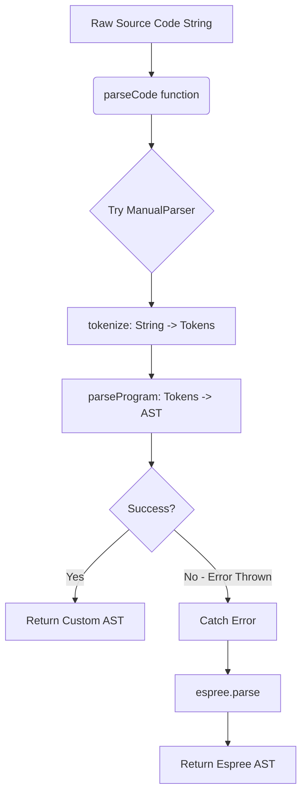

# Compiler Design Analysis: `parser.js`

## 1. 📌 File Overview
- **File Name:** `parser.js`
- **Purpose:** This file serves as the gateway for converting raw JavaScript source code into an Abstract Syntax Tree (AST). It implements a custom built-in parser (`ManualParser`) and provides a robust fallback mechanism using the external `espree` library.
- **Role in Pipeline:** This is the **first stage** of the IntelliComment engine pipeline. Before any static analysis, type inference, or Control Flow Graph (CFG) generation can occur, the code must be transformed from a flat text string into a structured data format. `parser.js` provides that foundational AST.

---

## 2. 🧠 High-Level Logic
**Overall Action:** The code acts as a dual-engine parsing system. It tries to quickly parse the code using a custom, lightweight recursive descent parser. If it encounters complex or modern JavaScript syntax that it doesn't support, it gracefully catches the error and hands the job over to Espree.

**Input → Processing → Output**   
- **Input:** Raw JavaScript source code (String).
- **Processing:** Tokenization (breaking string into words/symbols) followed by Parsing (arranging tokens into a tree).
- **Output:** An Abstract Syntax Tree (AST) Object.

**Main Classes/Functions:**
- `class ManualParser`: Handles tokenization and custom AST generation.
- `parseWithManualParser(code)`: Instantiates the class and triggers parsing.
- `parseCode(code)`: The exported facade function that orchestrates the manual attempt and the Espree fallback.

---

## 3. 🔄 Execution Flow
1. `parseCode(code)` is called with a string of JavaScript.
2. It attempts to call `parseWithManualParser(code)`.
3. `ManualParser` is instantiated. In its constructor, `tokenize()` is immediately called to convert the code string into an array of tokens.
4. `parseProgram()` is called, which loops through the tokens, expecting to find functions via `parseStatement()`.
5. As it parses statements and expressions, it builds an AST and returns it.
6. **Fallback Path:** If `ManualParser` throws an error (e.g., encountering an arrow function it doesn't understand), `parseCode` catches the error and executes `espree.parse()` instead.

### Execution Flowchart


---

## 4. 🏗️ Compiler Design Concepts Mapping

### 🔹 Lexical Analysis (Tokenization)
- **Concept:** Converting a stream of characters into a stream of meaningful symbols (lexemes/tokens).
- **In `parser.js`:** **Explicit tokenization** happens in the `tokenize()` method. A monolithic Regular Expression (`regex`) is used as a Lexical Scanner. It identifies groups: `PUNCT` (punctuation), `OP` (operators), `KW` (keywords), `ID` (identifiers), `NUM` (numbers), and `STR` (strings), while ignoring whitespace and comments.

### 🔹 Syntax Analysis (Parsing)
- **Concept:** Checking if the stream of tokens follows the grammar rules of the language.
- **In `parser.js`:** The `ManualParser` acts as a **Top-Down, Recursive Descent Parser**. It starts at the highest level grammar rule (`parseProgram`) and recursively descends into smaller rules (`parseStatement` → `parseFunctionDeclaration` → `parseBlockStatement`). It is highly predictive, looking at the current token (`peek()`) to decide which parsing path to take. 
- **Fallback:** Espree is a robust, external parser used when the custom top-down parser fails.

### 🔹 AST (Abstract Syntax Tree)
- **Concept:** A tree representation of the abstract syntactic structure of source code.
- **In `parser.js`:** The manual parser explicitly constructs nodes that are compliant with the **ESTree specification**. Nodes are standard JavaScript objects like:
  `{ type: "FunctionDeclaration", id: {...}, params: [...], body: {...} }`
  This uniformity ensures that downstream analyzers don't need to know whether the custom parser or Espree generated the tree.

### 🔹 Semantic Analysis, SDT, and CFG
- **Not present in this file.** `parser.js` strictly handles Lexical and Syntax analysis. It does *not* check if variables are defined (Semantic Analysis), it does not translate code as it parses (SDT), nor does it build graphs (CFG). It merely produces the raw AST structure which the rest of the IntelliComment pipeline will consume to perform those exact tasks.

---

## 5. 🔌 Code-Level Explanation

- **Lexical Scanner Loop (`tokenize`)**:
  ```javascript
  while ((match = regex.exec(this.code)) !== null) { ... }
  ```
  This loop acts as a Finite Automaton (implemented via regex engines). It advances through the code, categorizing matches. Note the line `["function", "return", "let", "const", "var"].includes(value) ? "KW" : "ID"`. This is classic compiler design: differentiating reserved keywords from generic identifiers.

- **Token Consumption (`peek`, `consume`, `match`)**:
  ```javascript
  peek() { return this.tokens[this.current]; }
  ```
  These utility functions manipulate a pointer (`this.current`) over the token array. `match()` conditionally consumes a token if it matches expected syntax (e.g., checking for an opening brace `{`), serving as the core mechanism for enforcing syntax rules.

- **Recursive Node Generation (`parseFunctionDeclaration`)**:
  ```javascript
  const id = { type: "Identifier", name: idToken.value };
  // ... parameter parsing ...
  const body = this.parseBlockStatement();
  return { type: "FunctionDeclaration", id, params, body };
  ```
  Here, the compiler maps the tokens to a hierarchical Node object. Notice how `parseFunctionDeclaration` suspends its own execution to call `parseBlockStatement`, waiting for the inner body to be parsed before returning the fully constructed branch of the tree.

---

## 6. 📊 Data Structures Used

- **Array (Token Stream):** `this.tokens = []`. Used as a linear buffer. Arrays are perfect here because lexical analysis produces a sequential, ordered list of tokens that the parser reads sequentially from left to right.
- **Tree (AST):** The output is a highly nested JavaScript Object (acting as an N-ary Tree). Trees are mathematically required for syntax analysis because programming languages possess recursive structures (e.g., an `IfStatement` can contain a `BlockStatement`, which can contain another `IfStatement`).
- **Regular Expressions:** Used in the lexical phase as representations of deterministic finite automata (DFAs) to quickly categorize strings of characters.

---

## 7. 🔗 Integration with Project

- **Position in Pipeline:** `Source Code -> [parser.js] -> AST -> functionExtractor.js`
- `parser.js` is required by `functionExtractor.js`. The extractor calls `parseCode(code)`. Once `parser.js` returns the AST, its job is entirely finished. The extractor then passes that AST to `StaticAnalyser.js` and `CfgGenerator.js`. 

---

## 8. 🧪 Example Walkthrough

**Input Snippet:** `function add(a) { return a + 1; }`

1. **Tokenization:**
   `regex` scans the string.
   - `function` -> `KW`
   - `add` -> `ID`
   - `(` -> `PUNCT`
   - `a` -> `ID` ...
2. **Parsing Program:** `parseProgram()` sees `KW` "function" and calls `parseFunctionDeclaration()`.
3. **Parsing Function:** Consumes "function", consumes "add" (creates Identifier node). Consumes "(". Consumes "a" (creates param Identifier node). Consumes ")". Calls `parseBlockStatement()`.
4. **Parsing Block:** Consumes "{". Sees `KW` "return". Calls `parseReturnStatement()`.
5. **Parsing Return:** Consumes "return". Calls `parseExpression()`.
6. **Parsing Expression:** `parsePrimary()` consumes "a" (Identifier). Sees `OP` "+". Consumes "+". `parsePrimary()` consumes "1" (Literal). Creates a `BinaryExpression` node combining "a", "+", and "1".
7. **Assembly:** Returns back up the call stack, wrapping the Expression in a Return node, wrapping that in a Block node, wrapping that in a Function node.
8. **Output:** A complete ESTree Object is returned to the main engine.

---

## 9. ⚠️ Edge Cases & Limitations

- **Syntax Support:** The `ManualParser` is intentionally rudimentary. It throws an error on modern JS syntax like Arrow Functions `() => {}`, Destructuring `const {a} = obj`, or classes.
- **Error Recovery:** The custom parser has "panic mode" limitations. If you forget a semicolon or bracket, it throws a generic hard error (`throw new Error("Expected...")`) rather than attempting to recover and parse the rest of the file.
- **Regex Performance:** Extremely large files might cause regex engine backtracking/performance issues during the monolithic `tokenize()` step.

---

## 10. 📈 Improvements

- **Remove the Regex Monolith:** Instead of one massive regex generating all tokens at once, a true lexical scanner generates tokens *on-demand* (`getNextToken()`). This saves memory and prevents parsing the entire file if a syntax error occurs on line 1.
- **Implement Pratt Parsing:** The current expression parsing (`parseExpression`) is very basic and doesn't handle operator precedence perfectly (BODMAS). Implementing a Pratt Parser (Top-Down Operator Precedence) would allow for mathematically accurate AST generation for complex equations.
- **AST Node Factory:** Instead of manually typing `{ type: "Identifier", name: token.value }` everywhere, creating node factory functions (`createIdentifier(value)`) would make the code cleaner and less prone to typos.
