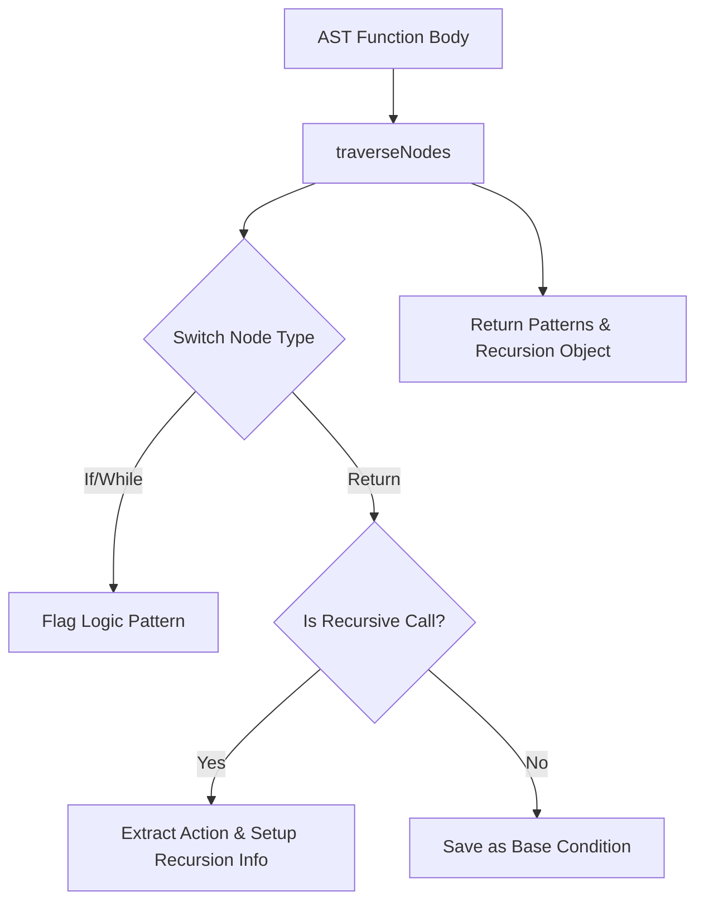

# Compiler Design Analysis: `StaticAnalyser.js`

## 1. 📌 File Overview
- **File Name:** `analyzer/StaticAnalyser.js`
- **Purpose:** Analyzes the Abstract Syntax Tree (AST) to detect coding patterns, logic, and recursive behaviors.
- **Role in Pipeline:** Represents the **Semantic Analysis** phase, extracting contextual meaning from the syntactically correct code.

## 2. 🧠 High-Level Logic
**Overall Action:** Recursively traverses the AST body of a function. It flags known patterns (like 'array manipulation' for `map`/`filter`) and specifically checks if a function is calling itself to map out recursion bases and steps.
**Input → Processing → Output**
- **Input:** AST of a function body and its name.
- **Processing:** AST Visitor traversal (`traverseNodes`).
- **Output:** An object containing `tags` (patterns) and `recursion` info.

## 3. 🔄 Execution Flow
1. Receives AST and function name.
2. Triggers `traverseNodes` on the main body.
3. Uses a `switch` statement on `node.type` to identify patterns.
4. If a `ReturnStatement` is found, it checks if it contains a recursive call using `checkCallRecursive`.
5. Accumulates results and returns them.

### Flowchart

## 4. 🏗️ Compiler Design Concepts Mapping

### 🔹 Semantic Analysis
- **Concept:** Understanding the meaning of statements beyond their grammar.
- **In Code:** Detecting that `array.map()` implies "array manipulation", or tracking a `ReturnStatement` inside an `IfStatement` to semantically label the `IfStatement`'s condition as a "base condition" for recursion.

### 🔹 AST Traversal / Visitor Pattern
- **Concept:** Systematically visiting nodes in a tree.
- **In Code:** `traverseNodes(nodes, currentCondition)` is a custom AST walker. It passes down `currentCondition` to children, which is an inherited attribute representing the context (e.g., "I am inside an If block").

## 5. 🔌 Code-Level Explanation
- **`checkCallRecursive(n)`**: A deep-search helper that looks for a `CallExpression` where `callee.name === functionName`.
- **`traverseNodes` switch cases**:
  - `IfStatement`: Passes the conditional test down as `currentCondition`. If the branch returns without recursing, that condition is saved as a base condition.
  - `ReturnStatement`: Analyzes the returned expression. If it's `return n * func(n-1)`, it extracts the `*` operator to generate the semantic meaning: "multiplies the result".

## 6. 📊 Data Structures Used
- **Set (`patterns = new Set()`)**: Used to collect unique tags (avoids duplicate "conditional logic" tags if there are multiple IFs).
- **Object (`recursionInfo`)**: A structured record to hold complex semantic data.

## 7. 🔗 Integration with Project
- **Position in Pipeline:** `AST -> [StaticAnalyser.js] -> Semantic Metadata`
- Invoked by the `functionExtractor` after parsing. Output feeds the JSDoc generator to create human-readable descriptions.

## 8. 🧪 Example Walkthrough
**Snippet:** `if (n === 0) return 1; return n * f(n-1);`
1. `traverseNodes` sees `IfStatement`. `currentCondition` becomes `n === 0`.
2. Traverses `return 1`. Not recursive. Saves `n === 0` to `baseConditions`.
3. Sees `return n * f(n-1)`. Recognizes `f()` as recursive. Extracts `*` operator as action "multiplies".

## 9. ⚠️ Edge Cases & Limitations
- **Scope Tracking:** Doesn't track variable shadowing. If an inner scope defines a local variable with the same name as the function, it might misidentify recursion.

## 10. 📈 Improvements
- Implement a complete Symbol Table to track scopes and bindings properly.
