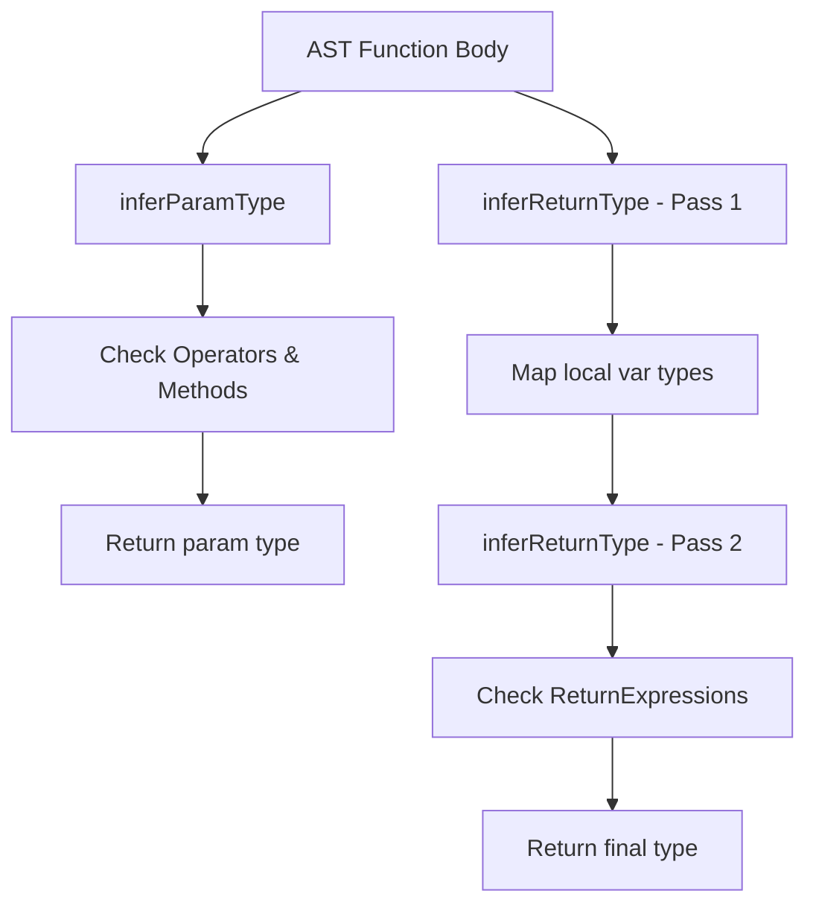

# Compiler Design Analysis: `TypeInterface.js`

## 1. 📌 File Overview
- **File Name:** `utils/TypeInterface.js`
- **Purpose:** Infers the data types of function parameters and return values by analyzing how they are used within the function body.
- **Role in Pipeline:** Core component of the **Semantic Analysis** phase (specifically **Type Inference / Type Checking**).

## 2. 🧠 High-Level Logic
**Overall Action:** Walks the AST looking for contextual clues. If a variable is multiplied, it must be a number. If `.map()` is called on it, it must be an array.
**Input → Processing → Output**
- **Input:** AST of a function body, and parameter names.
- **Processing:** Two-pass AST traversal (collecting variable types, checking returns).
- **Output:** String representing the inferred type (e.g., `"number"`, `"string | number"`, `"array"`).

## 3. 🔄 Execution Flow
1. **Parameter Inference (`inferParamType`)**: Walks the AST. Checks all `BinaryExpression`, `MemberExpression`, and `CallExpression` nodes involving the parameter. Adds inferred types to a Set.
2. **Return Inference (`inferReturnType`)**: 
   - Pass 1: Tracks local variable assignments to infer their types.
   - Pass 2: Inspects all `ReturnStatement` nodes and determines the type of the returned expression.

### Flowchart

## 4. 🏗️ Compiler Design Concepts Mapping

### 🔹 Semantic Analysis (Type Inference)
- **Concept:** Deducing the type of an expression automatically without explicit type annotations.
- **In Code:** Implements **Usage-Based Inference** (similar to Hindley-Milner type inference, but heuristic). It assumes that if `x` is used in `x > 5`, `x` is constrained to the `number` type.

### 🔹 Symbol Table (Lightweight)
- **Concept:** A data structure used by a compiler to keep track of semantics of identifiers.
- **In Code:** `variableTypes = new Map()` acts as a localized Symbol Table mapping variable names to their inferred types.

## 5. 🔌 Code-Level Explanation
- **`walk(node, visitor)`**: A generic AST traversal utility function.
- **`inferNodeReturnType(returnExpr, variableTypes)`**: Evaluates an expression. If it's a `Literal`, it uses `typeof`. If it's an `Identifier`, it looks it up in the `variableTypes` symbol table. If it's a `BinaryExpression` with `>`, it returns `'boolean'`.

## 6. 📊 Data Structures Used
- **Map (`variableTypes`)**: O(1) lookup for variable symbol tracking.
- **Set (`types`, `returnTypes`)**: Deduplicates inferred types. If a parameter is multiplied and divided, the Set ensures "number" is only recorded once.

## 7. 🔗 Integration with Project
- **Position in Pipeline:** `AST -> [TypeInterface.js] -> Type Strings`
- Called by `functionExtractor` to populate the `params` and `returns` fields of the metadata object.

## 8. 🧪 Example Walkthrough
**Snippet:** `function test(a) { let b = a * 2; return b > 10; }`
1. `inferParamType('a')`: Sees `a * 2`. `*` implies number. Returns `'number'`.
2. `inferReturnType()` Pass 1: Sees `b = a * 2`. Infers `a * 2` is a number. Maps `b -> 'number'`.
3. Pass 2: Sees `return b > 10`. Infers `>` operation yields boolean. Returns `'boolean'`.

## 9. ⚠️ Edge Cases & Limitations
- **JavaScript Coercion:** JS allows string concatenation with `+`. The inferencer struggles to differentiate `string + string` from `number + number` without deep context.
- **Complex Control Flow:** Doesn't track type narrowing (e.g., `if (typeof x === 'string')`).

## 10. 📈 Improvements
- Implement standard Forward/Backward Data Flow Analysis for types to handle type-narrowing and scope shadowing.
